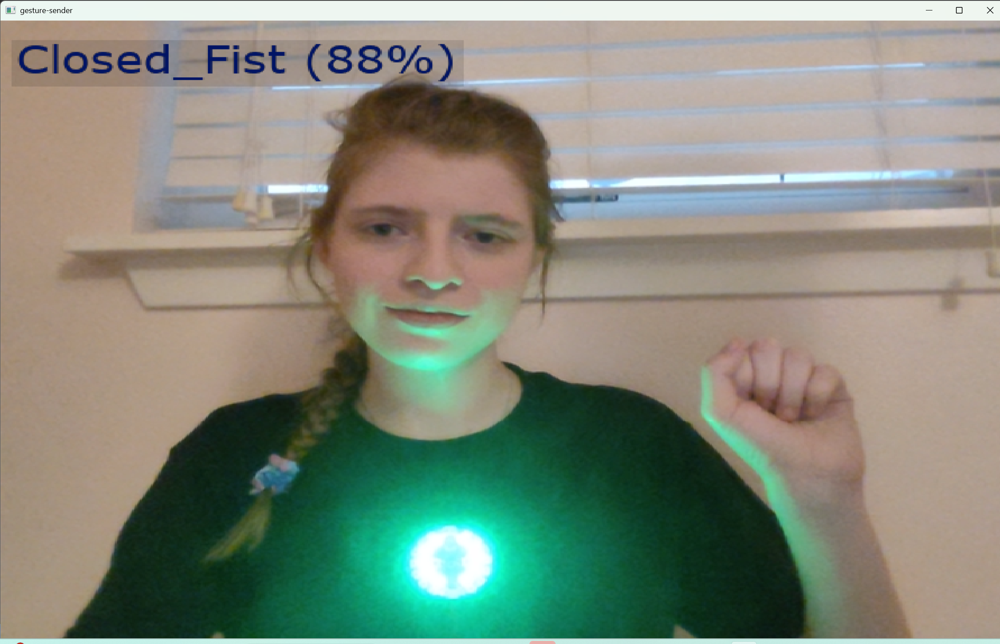
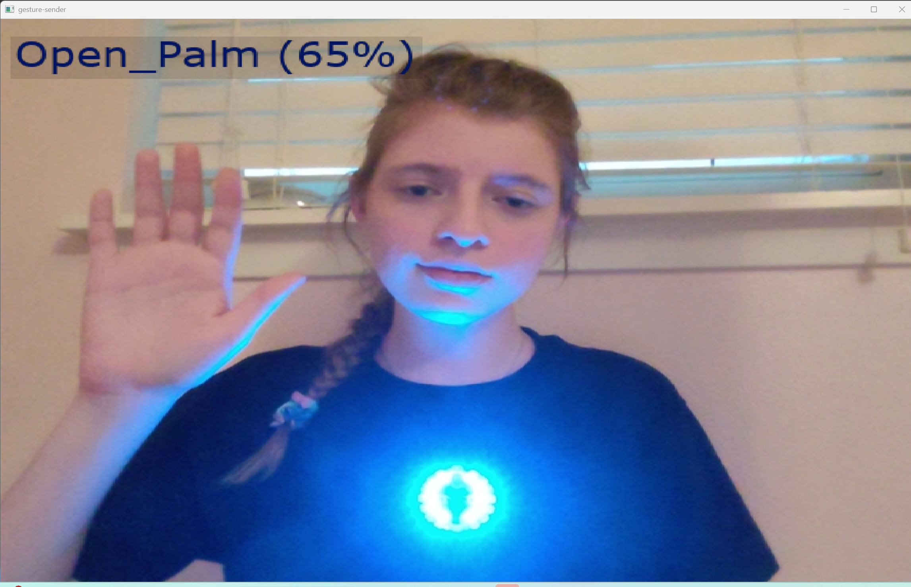
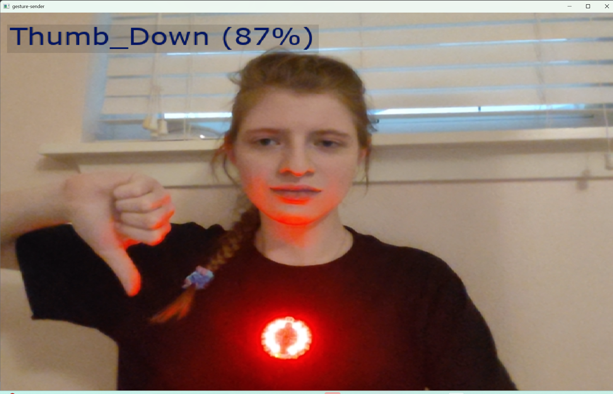

# LEARNED.md — Concepts and Debugging Lessons

<table>
  <tr>
    <td></td>
    <td></td>
    <td></td>

  </tr>
  <tr>
    <td></td>
    <td></td>
    <td></td>

  </tr>
  <tr>
    <td></td>
    <td></td>
    <td></td>
  </tr>
</table>

## Environment / tooling

- **Wheel availability is platform × Python-version × package specific.**
  `win_arm64` + newest Python + `opencv-contrib-python` was an empty
  intersection on PyPI, so pip silently fell back to a from-source build
  instead of erroring clearly. Lesson: on unusual platforms, check wheel
  availability *before* creating a venv, don't assume pip's fallback is benign.
- **x64 emulation on Windows-on-ARM is often the pragmatic fix**, not a hack —
  full wheel coverage beats fighting a from-source C++ build for a dependency
  you only consume.
- **Static analyzers can't see into compiled extensions.** Pylint's `E1101`
  false-positives on `cv2` stem from `astroid` doing pure static analysis with
  no import — compiled `.pyd` modules have no source to parse. Fix is an
  explicit opt-in (`extension-pkg-allow-list`) that permits Pylint to actually
  import and introspect the binary.
- **"Which interpreter is actually running this?" is the first diagnostic
  question**, always — before touching any config file. A linter using a
  different interpreter than your venv will report errors no config can fix,
  because the package genuinely isn't importable there. This explained why a
  correct `pyproject.toml` had zero effect: the extension was running
  system-wide against a Python install that never had `cv2`.
- **Aliasing an import (`import cv2 as cam`) doesn't change static analysis
  results** — tools resolve aliases back to the real module before doing member
  lookup. A test only has diagnostic value if its possible outcomes actually
  distinguish between competing hypotheses; this one didn't, for either
  hypothesis on the table at the time.

## MediaPipe

- **Three running modes (IMAGE / VIDEO / LIVE_STREAM) trade off blocking
  behavior, timestamp requirements, and hand tracking:**
  - IMAGE: blocking, no timestamps, no tracking between frames — every frame
    is a cold detection. Right for independent images, wrong for a live feed.
  - VIDEO: blocking, strictly-increasing timestamps required, has tracking.
  - LIVE_STREAM: non-blocking (`recognize_async` + callback), same strict
    timestamp requirement as VIDEO, has tracking, and **drops frames it can't
    keep up with** rather than queuing them — this is what keeps a live
    camera loop responsive under variable inference load.
  - Switching modes to dodge a bug is the wrong reflex if the bug isn't
    actually caused by the mode — verify that first.
- **"Monotonically increasing" in an API contract usually means *strictly*
  increasing.** `int(time.monotonic() * 1000)` truncation can produce equal
  consecutive values even though the underlying clock never goes backward.
  Fix: `if ts <= last_ts: ts = last_ts + 1`. General pattern: any quantized
  clock feeding a strict-increase API needs an explicit forward-progress guard
  — same bug shape recurs in Kafka timestamps, video PTS, etc.
- **A patch described in chat doesn't apply itself.** No live link exists
  between generated file contents and a local disk — "I told you the fix"
  and "the fix is in your file" are different states, and diffing the
  traceback's actual failing line against the intended patch is a fast way to
  catch the gap.

## pyserial

- **`timeout` only affects reads, never writes.** Three regimes: `None`
  (block forever), `0` (return immediately, possibly empty), `>0` (block up
  to N seconds, return partial data). `readline()` under a timed timeout can
  return a line **without** its trailing newline if the timeout expires
  first — a silent partial-read footgun.
- **VID/PID filtering (`serial.tools.list_ports.comports()`, `p.vid`) is the
  reliable way to find a specific device**, not a fixed COM number — Windows
  can reassign COM numbers per physical USB port. A hardcoded port is fine as
  a fast path *if* cross-checked against enumeration at startup, so a stale
  number fails loudly instead of writing bytes into the void.

## CircuitPython / usb_cdc

- **`usb_cdc.enable()` must run in `boot.py`, and only takes effect on a hard
  reset** (power-cycle), not on save. This was the root cause of the original
  `No CPX response` symptom — the data CDC interface simply didn't exist yet.
- **The CPX exposes two CDC ports once enabled**: console first, data second.
  Writing to the console port instead of the data port looks identical from
  the PC side (the write "succeeds") but the CPX-side reader never sees it.
- **A single `read(N)` call has no message-boundary guarantee.** `N` is a
  buffer-size hint affecting only latency/throughput, not correctness.
  Correctness comes from a persistent accumulator buffer plus delimiter-based
  parsing (`while b"\n" in buf: ...`) that reassembles messages regardless of
  how they were chunked across reads — the general "stream framing" problem,
  identical in shape to TCP.

## Python language mechanics (from line-by-line code review)

- **Closures:** a function defined inside another function captures variables
  from the enclosing scope by reference, not by value — this is how
  `on_result` (MediaPipe's callback, whose signature is fixed by the API and
  can't take extra arguments) writes into `main()`'s `latest` dict without
  it being passed in explicitly.
- **Mutation vs. reassignment inside a closure:** mutating a captured object
  (`latest["id"] = x`) works fine; *reassigning* the captured name
  (`latest = {...}`) makes Python treat it as a new local variable for the
  whole function, raising `UnboundLocalError` — unless declared `nonlocal`.
- **Context managers (`with ... as ...`):** guarantee `__exit__` runs even if
  the block raises, which is what reliably releases MediaPipe's native
  model/thread resources even when the timestamp `ValueError` crashed the
  loop mid-run. `ser` (the serial connection) is *not* wrapped this way in
  the current code — a real, currently-unaddressed gap if the CPX
  disconnects mid-run.
- **Leading-underscore convention (`_candidate`, `_count` vs. `stable`):**
  marks the private/public boundary of a class's API. `stable` is the only
  attribute external code (`main()`) should read; the others are
  mid-computation scratch state whose meaning could change (e.g. switching
  from frame-count to time-based debouncing) without needing to touch any
  caller.
- **Sentinel value collisions:** using a real data value (`current = 0`) to
  mean "nothing has happened yet" is only safe if that specific value's
  *effect* is a no-op relative to the pre-loop hardware state (gesture `0`
  → `(0,0,0)` → indistinguishable from CPX's default off state). It is not a
  generally safe pattern — remapping what `0` means later would silently
  reintroduce a missed-first-update bug with no change anywhere near the
  sentinel line itself. `current = -1` removes the dependency on that
  coincidence entirely, at zero cost.

## Debugging methodology notes

- **Splitting a system into independent layers** (vision / stream mechanics /
  transport / embedded) makes it possible to know *which* layer a bug lives
  in before investigating, rather than debugging the whole pipeline at once.
- **A good diagnostic test has discriminating power** — its possible outcomes
  should eliminate at least one live hypothesis. A test where every hypothesis
  predicts the same result is a wasted step, however cheap it feels.
- **When a symptom description and a traceback disagree** ("camera unstable"
  vs. `ValueError` in the log), the traceback is the ground truth; the
  symptom is just how the failure was perceived.

## To Change the Visuals 

- instead of using cv2 used PIL to change font, add semi-transparent box, change text color
- I copied the VERDANA.TTF from the Windows fonts and put it in a font folder. Used PILLOW library to use the font for the words appear on the screen

